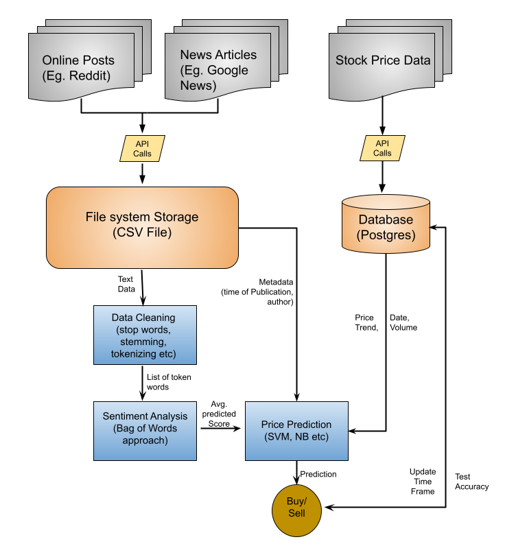

# CS488 Capstone Project
-Muskan Uprety

Link to Video: https://youtu.be/Pz5nZOfiCKw


## Stock Price Prediction Using Online Sentiment

The model explained by the diagram given below extracts public posts from users to assess the market sentiment for certain companies. We use certain keywords to extract these public posts and store them in a **CSV** file. In the next step, these posts are processed and fed into the sentiment analysis method which outputs sentiment for each post.

The output of this model, combined with some other data like date and time posted, market momentum for stock prices, current prices etc. are fed into a SVM classifier which predicts whether the price of the stock is going up or down in the future.

I will be updating the timeframe to analyze the time if/ how long social media posts have effect on prices.


## Running the process

First we need to get the dependencies for this project. There is a file called ```requirements.txt``` that has all the requirements for this project. Please install all the dependencies from there.

Next, enter the necessary information in credentials.py using ```vim``` command:
```
vim credentials.py
```

After that is done run ```process.sh``` file which will set up all the sql tables, download the required data, and make sure you are ready for running the model. 
Please refer to ```process.sh``` to see what it is doing as it is full of comments to guide you. You can make the changes you want (ex. picking different company tickers, changing keywords for text scraping etc.). 

To run the file, simply type the following in your terminal:

```
./process.sh
```

Final step is run the sentiment_analysis.py file and catch the output in a txt file. To do so, type the following in your terminal:

```
python3 sentiment_analysis.py > outout.txt
```

Note: this step takes a while to run. If you dont want to stare and wait for the process to finish, use the ```nohup``` command like this:

```
nohup python3 sentiment_analysis.py &
```

This will return you your terminal, and will create a file ```nohup.out``` that has the output once the process is complete.


## Software Architecture Diagram


